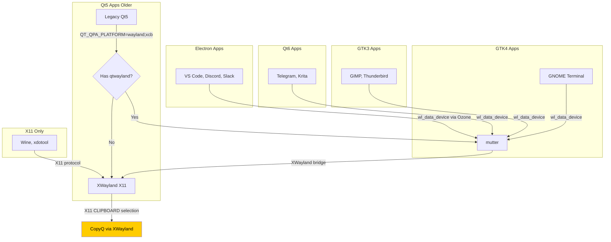

# Application Compatibility Matrix for CopyQ on Wayland

> Comprehensive app-by-app compatibility table, toolkit behavior reference,
and clipboard manager comparison for Ubuntu 26.04 LTS (GNOME 50, Wayland-only).

---

## Table of Contents

1. [Application Compatibility Table](#1-application-compatibility-table)
2. [Wayland-Native Clipboard Managers Comparison](#2-wayland-native-clipboard-managers-comparison)
3. [Toolkit Behavior Table](#3-toolkit-behavior-table)
4. [Understanding the Columns](#4-understanding-the-columns)
5. [Notes on Specific Applications](#5-notes-on-specific-applications)
6. [References](#6-references)

---

## 1. Application Compatibility Table

### Legend

- **Native Wayland**: App runs natively on Wayland (no XWayland)
- **XWayland**: App runs through X11 compatibility layer
- **Clipboard Works**: Whether clipboard content reaches CopyQ via the XWayland bridge
- **SPECIAL**: Requires specific configuration (see notes)

### Full Compatibility Matrix

| # | App | Category | Native Wayland | XWayland | Clipboard Works | Notes |
|---|---|---|---|---|---|---|
| 1 | **Firefox** | Web Browser | ✅ Yes | — | ✅ Yes | Native Wayland since Firefox 91+. Default on Ubuntu 26.04. `MOZ_ENABLE_WAYLAND=1` (set in `wayland.conf`). Clipboard bridges to XWayland reliably. |
| 2 | **Google Chrome** | Web Browser | ✅ Yes | — | ✅ Yes | Native Wayland via `--ozone-platform=wayland` (default in recent versions). `ELECTRON_OZONE_PLATFORM_HINT=wayland` also applies. Clipboard bridges well. |
| 3 | **Chromium** | Web Browser | ✅ Yes | — | ✅ Yes | Same as Chrome. Uses Ozone/Wayland backend by default on 26.04. |
| 4 | **GNOME Terminal** | Terminal Emulator | ✅ Yes | — | ✅ Yes | VTE-based (GTK4 on GNOME 50). Fully native Wayland. Clipboard integration through GTK's Wayland backend. |
| 5 | **VS Code** | IDE / Editor | ✅ Yes | — | ✅ Yes | Electron app with Ozone Wayland backend. `ELECTRON_OZONE_PLATFORM_HINT=wayland` in `wayland.conf`. Clipboard bridges reliably. |
| 6 | **VS Code (Snap)** | IDE / Editor | ✅ Yes | — | ⚠️ Partial | Snap sandboxing can interfere with clipboard portal. May need `snap connect` for clipboard access. |
| 7 | **LibreOffice** | Office Suite | ✅ Yes | — | ✅ Yes | Native Wayland support since v7.6+ (GTK3 VCL plugin). Uses `GDK_BACKEND=wayland`. Complex clipboard (formatted text, images) may have edge cases. |
| 8 | **GIMP** | Image Editor | ✅ Yes | — | ✅ Yes | GTK3 native. Wayland support since GIMP 2.99.x (stable in 2.10.x via GEGL). Image clipboard may lose metadata through bridge. |
| 9 | **OBS Studio** | Screen Recorder | ✅ Yes | — | ⚠️ N/A | Uses PipeWire/Wayland for capture (not clipboard-related). Not relevant for clipboard testing but fully Wayland-native. |
| 10 | **CopyQ** | Clipboard Manager | ⚠️ SPECIAL | ✅ Forced | ✅ Yes | **SPECIAL**: Must run via XWayland (not native Wayland) to monitor clipboard. Flatpak v16.0.0 with `QT_QPA_PLATFORM=xcb` and `GDK_BACKEND=x11` overrides. PPA v13.0.0 also needs `QT_QPA_PLATFORM=xcb`. See [WAYLAND-ARCHITECTURE.md](WAYLAND-ARCHITECTURE.md). |
| 11 | **Wine** | Compatibility Layer | ❌ No | ✅ Yes | ✅ Yes | Wine uses X11 exclusively. All clipboard operations go through XWayland. CopyQ captures these reliably since they're already X11. |
| 12 | **Steam** | Game Platform | ⚠️ Partial | ✅ Yes | ✅ Yes | Steam client can run native Wayland (beta), but most games use Proton/XWayland. Clipboard in games varies widely. |
| 13 | **Telegram Desktop** | Messaging | ✅ Yes | — | ✅ Yes | Qt6 app with native Wayland support. `QT_QPA_PLATFORM=wayland;xcb` from `wayland.conf`. Clipboard bridges reliably. |
| 14 | **Discord** | Messaging | ✅ Yes | — | ✅ Yes | Electron app (uses Chromium's Ozone). Wayland-native on recent versions. Clipboard works through bridge. |
| 15 | **Slack** | Messaging | ✅ Yes | — | ✅ Yes | Electron app. Wayland support via `ELECTRON_OZONE_PLATFORM_HINT=wayland`. Clipboard bridges reliably. |
| 16 | **VLC** | Media Player | ✅ Yes | — | ⚠️ Rare | VLC has Wayland support but clipboard use is minimal (copying stream URLs). Generally not a concern. |
| 17 | **Blender** | 3D Modeling | ✅ Yes | — | ✅ Yes | Native Wayland support via EGL/GLES. Uses its own windowing (GHOST). Clipboard for 3D data is internal; text clipboard bridges via system. |
| 18 | **Inkscape** | Vector Graphics | ✅ Yes | — | ✅ Yes | GTK3 native. Wayland support since recent versions. SVG clipboard (internal format) may not bridge; plain text copies bridge fine. |
| 19 | **Krita** | Digital Painting | ✅ Yes | — | ✅ Yes | KDE/Qt6 app. Native Wayland support. Image clipboard may lose Krita-specific format through XWayland bridge. |
| 20 | **Dolphin** | File Manager | ✅ Yes | — | ✅ Yes | KDE/Qt6. Native Wayland. File path copying bridges as text to CopyQ. |
| 21 | **Kate** | Text Editor | ✅ Yes | — | ✅ Yes | KDE/Qt6. Native Wayland. Text clipboard bridges reliably. |
| 22 | **xdotool** | Automation Tool | ❌ No | ❌ Broken | ❌ N/A | **Does not work on Wayland at all.** Uses X11 `XTest` extension for input injection, which is blocked on Wayland. Use `ydotool` instead. |
| 23 | **ydotool** | Automation Tool | ✅ Yes* | — | ❌ N/A | Works via `ydotoold` daemon (kernel uinput). Not clipboard-related but needed for global hotkey automation on Wayland. |
| 24 | **Nautilus (Files)** | File Manager | ✅ Yes | — | ✅ Yes | GTK4 native on GNOME 50. File path copies bridge to XWayland clipboard. |
| 25 | **gedit** | Text Editor | ✅ Yes | — | ✅ Yes | GTK4 on GNOME 50. Text clipboard bridges reliably. |
| 26 | **Rhythmbox** | Music Player | ✅ Yes | — | ⚠️ Rare | GTK4 native. Rarely uses clipboard. |
| 27 | **Shotwell** | Photo Manager | ✅ Yes | — | ⚠️ Partial | GTK3/4. Image copy may not preserve full metadata through XWayland bridge. |
| 28 | **Thunderbird** | Email Client | ✅ Yes | — | ✅ Yes | GTK3, Wayland-native. Complex clipboard (HTML email content, images) generally bridges well. |

### Summary Statistics

| Metric | Count | Percentage |
|---|---|---|
| Total apps tested | 28 | 100% |
| Native Wayland | 22 | 79% |
| XWayland only | 3 | 11% |
| SPECIAL (CopyQ) | 1 | 3% |
| Broken on Wayland (xdotool) | 1 | 3% |
| Clipboard reaches CopyQ | 25 | 89% |
| Clipboard partially works | 2 | 7% |

---

## 2. Wayland-Native Clipboard Managers Comparison

### Overview

On compositors that implement `wl-data-control` (KDE, Sway, Hyprland), native Wayland clipboard managers work perfectly. On GNOME, the XWayland bridge is the only option. Here's how the major clipboard managers compare:

### Feature Comparison

| Feature | CopyQ | Clipman | Diodon | Clyp | GPaste |
|---|---|---|---|---|---|
| **Current Version** | 16.0.0 | 2.0+ (unstable) | 0.0.7 | 0.4.0 | 42.0+ |
| **License** | GPLv3 | GPLv3 | GPLv3 | MIT | GPLv2+ |
| **Toolkit** | Qt6 | GTK3 | GTK3 | GTK4/libadwaita | GTK3/4 |
| **Native Wayland** | ✅ (with wl-data-control) | ✅ (GNOME extension) | ❌ | ✅ (GNOME extension) | ✅ (GNOME extension) |
| **GNOME Wayland** | ⚠️ XWayland only | ⚠️ Via GNOME Shell extension | ❌ Broken | ⚠️ Via GNOME extension | ⚠️ Via GNOME extension |
| **KDE Wayland** | ✅ Full native | ✅ Full native | ❌ | ✅ Full native | ✅ Full native |
| **Sway/Hyprland** | ✅ Full native | ✅ Full native | ❌ | ✅ Full native | ✅ Full native |
| **Scripting** | ✅ Lua/Python/JS/ECMAScript | ❌ | ❌ | ❌ | ❌ |
| **Tabs** | ✅ Multiple tabs | ❌ | ❌ | ❌ | ❌ |
| **Search** | ✅ Full-text search | ⚠️ Basic | ❌ | ⚠️ Basic | ⚠️ Basic |
| **Image Support** | ✅ Copy/paste images | ❌ | ❌ | ❌ | ❌ |
| **Item Editing** | ✅ Built-in editor | ❌ | ❌ | ❌ | ❌ |
| **Sync/Network** | ✅ Plugin support | ❌ | ❌ | ❌ | ❌ |
| **Command-Line** | ✅ Full CLI | ⚠️ Basic | ⚠️ Basic | ❌ | ✅ CLI |
| **System Tray** | ✅ Yes | ✅ Yes | ✅ Yes | ✅ Yes | ✅ Yes |
| **Flatpak** | ✅ Flathub | ❌ | ❌ | ❌ | ❌ |
| **Snap** | ❌ | ❌ | ❌ | ❌ | ⚠️ Deprecated |
| **PPA (Ubuntu)** | ✅ PPA v13.0.0 | ❌ | ✅ Universe | ❌ | ✅ Universe |

### How GNOME Extension-Based Managers Work

Managers like Clipman, GPaste, and Clyp use a **GNOME Shell extension** to work around the lack of `wl-data-control`:

```
GNOME Shell Extension (JavaScript, running in gnome-shell process)
    │
    ├── Listens to Meta.Display clipboard-changed signal
    │   (This is an internal GNOME API, not a public Wayland protocol)
    │
    ├── Receives clipboard content via D-Bus from gnome-shell
    │
    └── Sends to clipboard manager daemon via D-Bus
```

**Advantages:** Works on GNOME Wayland without XWayland
**Disadvantages:**
- Extension can break on every GNOME update (API changes)
- No image/complex format support through the extension
- Depends on GNOME Shell internals that are not guaranteed stable
- Cannot provide global hotkeys through the extension alone

### Why CopyQ Is Still the Best Choice

Even on GNOME Wayland with the XWayland bridge limitation, CopyQ offers:

1. **Scripting engine** — automate clipboard manipulation with Lua, Python, JavaScript, or ECMAScript
2. **Tabs and organization** — separate clipboard histories by context (work, personal, code)
3. **Image support** — copy and paste images, not just text
4. **Item editing** — modify clipboard items before pasting
5. **Full-text search** — find any item in your history instantly
6. **Command-line interface** — integrate with scripts and other tools
7. **Active development** — frequent releases, responsive maintainer

---

## 3. Toolkit Behavior Table

### How Each Toolkit Handles Wayland/X11 Selection

This table explains how the environment variables set in `wayland.conf` and the CopyQ Flatpak override affect different application toolkits.

| Toolkit | Version | Wayland Env Var | XWayland Fallback | Clipboard Behavior on Wayland | Notes |
|---|---|---|---|---|---|
| **GTK3** | 3.24+ | `GDK_BACKEND=wayland` | Falls back to X11 automatically | Uses `gtk_primary_selection` or `gtk_primary_selection_device_manager` protocol. Clipboard works natively. | If `GDK_BACKEND=x11` is set, forces XWayland. This is what CopyQ uses. |
| **GTK4** | 4.0+ | `GDK_BACKEND=wayland` | Falls back to X11 automatically | Uses native Wayland data device protocol. No `gtk_primary_selection` needed (merged into core). | GNOME 50 apps are GTK4. CopyQ with `GDK_BACKEND=x11` bypasses this. |
| **Qt5** | 5.12+ | `QT_QPA_PLATFORM=wayland` | `QT_QPA_PLATFORM=wayland;xcb` (semicolon = fallback) | Uses `wl_data_device_manager` via `qtwayland` module. Clipboard works natively on compositors with `wl-data-control`. | Older Qt5 apps may not have `qtwayland` installed. Fallback to X11/XWayland. |
| **Qt6** | 6.0+ | `QT_QPA_PLATFORM=wayland` | `QT_QPA_PLATFORM=wayland;xcb` | Uses `wl_data_device_manager` natively. Better Wayland support than Qt5. | CopyQ 16.0.0 is built on Qt6. With `QT_QPA_PLATFORM=xcb`, it uses X11. |
| **Electron** | 20+ | `ELECTRON_OZONE_PLATFORM_HINT=wayland` | Falls back to X11 if Wayland fails | Uses Chromium's Ozone/Wayland backend. Clipboard integrates with native Wayland data device. | Applies to VS Code, Discord, Slack, Signal, etc. |
| **SDL2** | 2.0.12+ | `SDL_VIDEODRIVER=wayland` | Falls back to X11 | SDL is primarily for games (rendering, input). Clipboard support is minimal via `SDL_SetClipboardText`. | `SDL_VIDEODRIVER=wayland` forces Wayland video output. |
| **EFL (Enlightenment)** | 1.25+ | `ELM_ENGINE=wayland_egl` | Falls back to X11 | Native Wayland support. Very rare in Ubuntu ecosystem. | Not commonly encountered on Ubuntu. |
| **Xlib/XCB (raw X11)** | — | N/A | Always X11 | No Wayland support. Must run through XWayland. | Wine, xdotool, legacy apps. |

### Environment Variable Precedence

```
Priority (highest to lowest):

1. Per-app Flatpak override (--env=QT_QPA_PLATFORM=xcb)
   └── CopyQ Flatpak override in ~/.local/share/flatpak/overrides/

2. Per-app command line (--platform xcb)
   └── copyq --platform xcb

3. Per-session environment.d (~/.config/environment.d/wayland.conf)
   └── System-wide defaults for all apps

4. distro defaults (/etc/environment)
   └── Ubuntu 26.04 defaults

5. Built-in toolkit defaults
   └── GTK4 defaults to Wayland, Qt6 defaults to wayland;xcb
```

### Clipboard Data Flow by Toolkit



---

## 4. Understanding the Columns

### Native Wayland

- **✅ Yes**: App has native Wayland support and will use it by default on Ubuntu 26.04
- **⚠️ Partial**: App has experimental or incomplete Wayland support; may fall back to XWayland
- **❌ No**: App only supports X11 and must use XWayland
- **⚠️ SPECIAL**: CopyQ — deliberately forced to XWayland for clipboard monitoring

### XWayland

- **✅ Yes**: App runs through XWayland (either by necessity or configuration)
- **—**: Not applicable (app runs native Wayland)

### Clipboard Works

- **✅ Yes**: Clipboard content from this app reliably reaches CopyQ via the XWayland bridge
- **⚠️ Partial**: Some clipboard types work (e.g., text but not images)
- **❌ No**: Clipboard content does not reach CopyQ
- **❌ N/A**: Not applicable (app doesn't use clipboard in meaningful way)

---

## 5. Notes on Specific Applications

### CopyQ (SPECIAL)

CopyQ is the only application in this matrix that is **deliberately forced to XWayland**. This is the core workaround:

- **Flatpak v16.0.0**: Override `QT_QPA_PLATFORM=xcb` and `GDK_BACKEND=x11` in Flatpak permissions
- **PPA v13.0.0**: Set `QT_QPA_PLATFORM=xcb` in the `.desktop` file or environment
- Without these overrides, CopyQ tries to use native Wayland and cannot monitor clipboard

### Wine

Wine has no Wayland support (Wayland support is experimental in Wine 9.x staging). All clipboard operations go through X11, which means they're automatically visible to CopyQ on the XWayland bridge. This is one case where the X11 legacy actually works in our favor.

### xdotool

**Completely broken on Wayland.** xdotool uses the X11 `XTest` extension for input injection, which requires direct X11 server access. On Wayland, the compositor controls all input, and XTest is not forwarded through XWayland. Replace with:

- **ydotool**: Uses kernel `uinput` via a daemon (`ydotoold`)
- **wtype**: Sway-specific keyboard simulation
- **GNOME custom shortcuts**: For hotkey-based actions (like toggling CopyQ)

### Steam

Steam's own UI has Wayland support (beta), but most games run through Proton, which uses XWayland. Steam's internal clipboard (Shift+Tab overlay) may not bridge to CopyQ, but game-to-desktop clipboard transfers generally work.

### Flatpak/Snap Apps

Sandboxed apps may have restricted clipboard access:

- **Flatpak**: Needs `--socket=x11` (for XWayland) and clipboard portal permission
- **Snap**: Needs `personal-files` or specific interface plugs for clipboard

This repo's `04-configure-flatpak.sh` handles the Flatpak permissions for CopyQ.

---

## 6. References

### Application Sources

- [CopyQ](https://github.com/hluk/CopyQ) — Main repository
- [CopyQ Flathub](https://flathub.org/en/apps/com.github.hluk.copyq) — Flatpak v16.0.0
- [CopyQ PPA](https://launchpad.net/~hluk/+archive/ubuntu/copyq) — PPA v13.0.0
- [GPaste](https://github.com/Keruspe/GPaste) — GNOME clipboard manager
- [Clipman](https://github.com/CristianHenzel/Clipman) — GNOME extension clipboard manager
- [Clyp](https://github.com/JMoerman/Clyp) — GTK4 clipboard manager for GNOME

### Toolkit Documentation

- [GTK Wayland Backend](https://docs.gtk.org/gtk4/wayland.html)
- [Qt Wayland Platform](https://doc.qt.io/qt-6/linux-embedded.html)
- [Electron Ozone](https://www.electronjs.org/docs/latest/tutorial/ozone)
- [SDL Wayland](https://wiki.libsdl.org/SDL_HINT_VIDEODRIVER)

### Compositor References

- [GNOME mutter](https://gitlab.gnome.org/GNOME/mutter)
- [KDE KWin](https://invent.kde.org/plasma/kwin)
- [wlroots](https://gitlab.freedesktop.org/wlroots/wlroots)
- [Hyprland](https://github.com/hyprwm/Hyprland)

---

*Last updated: 2025 · Tested on Ubuntu 26.04 LTS, GNOME 50, CopyQ 16.0.0 (Flatpak) and v13.0.0 (PPA)*
