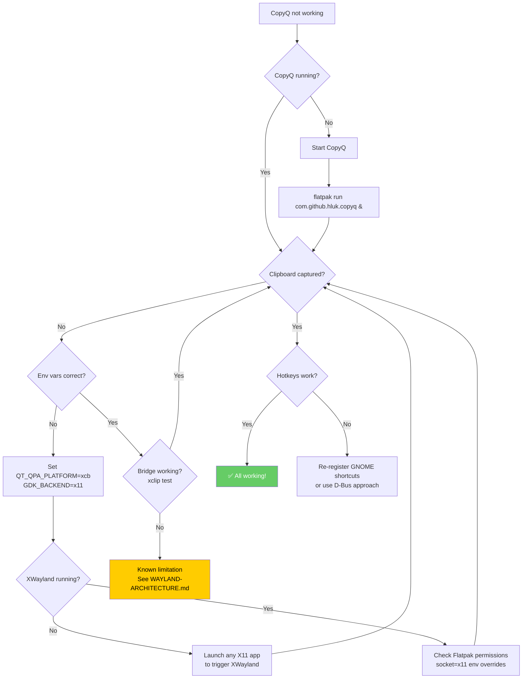

# CopyQ Troubleshooting Guide for Ubuntu 26.04 LTS (Wayland-Only)

> Step-by-step diagnosis and resolution for every known failure mode.
> Each section follows: **Problem → Diagnosis Steps → Solution → Verification**.

---

## Table of Contents

1. [CopyQ Not Capturing Clipboard](#1-copyq-not-capturing-clipboard)
2. [Global Hotkeys Not Working](#2-global-hotkeys-not-working)
3. [CopyQ Window Rendering Issues](#3-copyq-window-rendering-issues)
4. [Autostart Failures](#4-autostart-failures)
5. [Flatpak-Specific Issues](#5-flatpak-specific-issues)
6. [After System Update Breaks](#6-after-system-update-breaks)
7. [Diagnostic Commands Cheat Sheet](#7-diagnostic-commands-cheat-sheet)

---

## 1. CopyQ Not Capturing Clipboard

### Problem

You copy text in Firefox, GNOME Terminal, or another app, but CopyQ's history does not show the new item. The tray icon may or may not indicate activity.

### Diagnosis Steps

**Step 1: Check that XWayland is running**

```bash
ps aux | rg -i xwayland
```

Expected output: A process line like:
```
/usr/lib/xorg/Xwayland :0 -rootless -core -listen none -displayfd 7 ...
```

If no output: XWayland is not running. See Step 3.

**Step 2: Check CopyQ's environment variables**

```bash
# For Flatpak installation:
flatpak info --show-permissions com.github.hluk.copyq | rg -i 'QT_QPA|GDK_BACKEND'

# For PPA/deb installation:
# Check the CopyQ process environment:
copyq --version
pgrep -a copyq
# Then check environment of the running process:
PID=$(pgrep -f 'copyq' | head -1)
if [ -n "$PID" ]; then
    cat /proc/$PID/environ | tr '\0' '\n' | rg 'QT_QPA|GDK_BACKEND'
fi
```

Expected: `QT_QPA_PLATFORM=xcb` and `GDK_BACKEND=x11`

If you see `wayland` instead of `xcb`/`x11`: CopyQ is running native Wayland and **cannot** monitor the clipboard on GNOME. See Solution.

**Step 3: Verify the XWayland bridge is active**

```bash
# Check that XWayland DISPLAY is accessible
xdpyinfo -display :0 2>&1 | head -5
```

Expected: Information about the X display (screen dimensions, vendor, etc.)

If error "Can't open display": XWayland X server is not accessible.

**Step 4: Test clipboard manually**

```bash
# Install xclip if needed
sudo apt install xclip

# In a terminal, copy some text:
echo "test clipboard bridge" | xclip -selection clipboard

# Check if CopyQ captured it:
copyq read 0
```

If `copyq read 0` shows the test text: The bridge is working for X11-originated copies.

If `copyq read 0` is empty: CopyQ is not monitoring X11 clipboard at all.

### Solution

**If CopyQ is running native Wayland (wrong environment variables):**

```bash
# Flatpak: Force XWayland environment
flatpak override --user com.github.hluk.copyq \
    --env=QT_QPA_PLATFORM=xcb \
    --env=GDK_BACKEND=x11

# Restart CopyQ
copyq exit 2>/dev/null
flatpak run com.github.hluk.copyq &
```

```bash
# PPA/deb: Set environment in .desktop file or systemd service
# Edit the Exec line in ~/.local/share/applications/copyq.desktop:
# Exec=env QT_QPA_PLATFORM=xcb GDK_BACKEND=x11 copyq %U
```

**If XWayland is not running:**

XWayland starts on-demand when an X11 client connects. Try launching any X11 app to trigger it:

```bash
xeyes &
# or
xclock &
```

If XWayland still doesn't start, your system may have a broken XWayland installation:

```bash
sudo apt install --reinstall xwayland
```

**If clipboard from specific apps isn't bridged:**

Some apps may not bridge clipboard content to XWayland. This is a known limitation — see [WAYLAND-ARCHITECTURE.md](WAYLAND-ARCHITECTURE.md) section 4 for details on bridge limitations.

### Verification

```bash
# 1. Copy this text in any app: "CopyQ verification test 12345"
# 2. Wait 1 second
# 3. Run:
copyq read 0
# Expected output: "CopyQ verification test 12345"
```

---

## 2. Global Hotkeys Not Working

### Problem

You press the configured hotkey (e.g., `Ctrl+Alt+V`) and nothing happens. CopyQ's window doesn't appear.

### Diagnosis Steps

**Step 1: Check GNOME custom shortcuts**

```bash
gsettings get org.gnome.settings-daemon.plugins.media-keys custom-keybindings
```

Expected: A list of paths like:
```
['/org/gnome/settings-daemon/plugins/media-keys/custom-keybindings/custom0/', '/org/gnome/settings-daemon/plugins/media-keys/custom-keybindings/custom1/']
```

If empty or doesn't include CopyQ shortcuts: The shortcuts were not registered.

**Step 2: Verify the shortcut key bindings**

```bash
# List all custom shortcuts
gsettings list-recursively org.gnome.settings-daemon.plugins.media-keys.custom-keybinding | rg -i copyq
```

Expected: Entries showing the command (`copyq toggle`) and binding (`<Ctrl><Alt>v`).

**Step 3: Check for conflicts**

```bash
# List ALL shortcuts to find conflicts
gsettings list-recursively org.gnome.settings-daemon.plugins.media-keys | rg '<Ctrl><Alt>v'
```

If multiple entries match: Another application or GNOME feature is using the same shortcut.

**Step 4: Test if xdotool is the culprit**

```bash
which xdotool 2>/dev/null && echo "xdotool found" || echo "xdotool not found"
```

If `xdotool` is installed: It does not work on Wayland. Any script using `xdotool` for hotkey simulation will fail.

### Solution

**Re-register GNOME shortcuts:**

```bash
# Run the installer's shortcut setup directly
bash /path/to/copyq-linux-fix/scripts/05-setup-shortcuts.sh
```

Or manually:

```bash
# Register shortcut for Ctrl+Alt+V (toggle CopyQ)
gsettings set org.gnome.settings-daemon.plugins.media-keys custom-keybindings \
    "['/org/gnome/settings-daemon/plugins/media-keys/custom-keybindings/custom0/']"

gsettings set org.gnome.settings-daemon.plugins.media-keys.custom-keybinding:/org/gnome/settings-daemon/plugins/media-keys/custom-keybindings/custom0/ name 'CopyQ Toggle'
gsettings set org.gnome.settings-daemon.plugins.media-keys.custom-keybinding:/org/gnome/settings-daemon/plugins/media-keys/custom-keybindings/custom0/ command '/usr/bin/flatpak run --branch=stable --arch=x86_64 --command=copyq com.github.hluk.copyq toggle'
gsettings set org.gnome.settings-daemon.plugins.media-keys.custom-keybinding:/org/gnome/settings-daemon/plugins/media-keys/custom-keybindings/custom0/ binding '<Ctrl><Alt>v'
```

**If there's a shortcut conflict:**

Open **Settings > Keyboard > View and Customize Shortcuts > Custom Shortcuts** and change the conflicting shortcut.

**Replace xdotool with ydotool:**

```bash
# Remove xdotool
sudo apt remove xdotool

# Install ydotool
sudo apt install ydotool
sudo systemctl enable --now ydotool

# Test
ydotool type "hello world"
```

**Alternative: D-Bus approach for toggling CopyQ**

```bash
# CopyQ listens on D-Bus — you can trigger it without hotkeys
dbus-send --session --dest=com.github.hluk.copyq /com/github/hluk/copyq com.github.hluk.copyq.toggle
```

### Verification

```bash
# 1. Press Ctrl+Alt+V
# 2. If CopyQ window appears, it works
# 3. If not, try the D-Bus command:
dbus-send --session --dest=com.github.hluk.copyq /com/github/hluk/copyq com.github.hluk.copyq.toggle
# 4. If D-Bus works but hotkey doesn't: shortcut registration issue
# 5. If D-Bus doesn't work: CopyQ isn't running
copyq exit 2>/dev/null; flatpak run com.github.hluk.copyq &
```

---

## 3. CopyQ Window Rendering Issues

### Problem

CopyQ's main window, menu, or item preview appears blank, transparent, garbled, or has visual artifacts. The window may be completely invisible or have black/white rectangles.

### Diagnosis Steps

**Step 1: Check if CopyQ is using X11 or Wayland rendering**

```bash
PID=$(pgrep -f 'copyq' | head -1)
if [ -n "$PID" ]; then
    cat /proc/$PID/environ | tr '\0' '\n' | rg 'QT_QPA|GDK_BACKEND|WAYLAND_DISPLAY'
fi
```

- If `WAYLAND_DISPLAY` is set but `GDK_BACKEND`/`QT_QPA_PLATFORM` is not forced to `x11`/`xcb`: CopyQ may be trying native Wayland rendering
- If `GDK_BACKEND=x11` and `QT_QPA_PLATFORM=xcb`: Correct XWayland mode

**Step 2: Check GPU driver status**

```bash
# Check what GPU is in use
glxinfo 2>/dev/null | rg 'OpenGL renderer' || echo "glxinfo not available (install mesa-utils)"

# Check for GPU errors in journalctl
journalctl --user -b | rg -i 'gpu|drm|render|copyq' | tail -20
```

**Step 3: Test with forced X11 rendering**

```bash
# Kill CopyQ and restart with explicit X11
copyq exit 2>/dev/null
sleep 1
GDK_BACKEND=x11 QT_QPA_PLATFORM=xcb flatpak run com.github.hluk.copyq &
```

If the window renders correctly: The issue was CopyQ running with mixed Wayland/X11 backends.

### Solution

**Force GDK_BACKEND=x11 for CopyQ (most common fix):**

```bash
flatpak override --user com.github.hluk.copyq --env=GDK_BACKEND=x11
flatpak override --user com.github.hluk.copyq --env=QT_QPA_PLATFORM=xcb
copyq exit 2>/dev/null
sleep 1
flatpak run com.github.hluk.copyq &
```

**If rendering still fails, try disabling GPU acceleration in Qt:**

```bash
flatpak override --user com.github.hluk.copyq \
    --env=QT_QPA_PLATFORM=xcb \
    --env=GDK_BACKEND=x11 \
    --env=QT_XCB_NO_MITSHM=1 \
    --env=LIBGL_ALWAYS_SOFTWARE=1
copyq exit 2>/dev/null
sleep 1
flatpak run com.github.hluk.copyq &
```

**For NVIDIA GPU users:**

```bash
# Ensure NVIDIA Wayland support is installed
sudo apt install nvidia-driver-550  # or your version

# Check NVIDIA driver is loaded
lsmod | rg nvidia

# If using NVIDIA proprietary drivers, you may need:
flatpak override --user com.github.hluk.copyq \
    --env=__NV_PRIME_RENDER_OFFLOAD=1 \
    --env=__GLX_VENDOR_LIBRARY_NAME=nvidia
```

**For Flatpak: check if GPU access is granted:**

```bash
flatpak info --show-permissions com.github.hluk.copyq | rg -i 'device|gpu|drm'
```

If no device permissions: CopyQ can't access the GPU.

```bash
flatpak override --user com.github.hluk.copyq --device=all
copyq exit 2>/dev/null
sleep 1
flatpak run com.github.hluk.copyq &
```

### Verification

```bash
# 1. CopyQ window should be fully visible with correct colors
# 2. Test the menu: click the tray icon, menu should render properly
# 3. Test item preview: select an item, it should display correctly
# 4. Test transparency: items with images should show previews
```

---

## 4. Autostart Failures

### Problem

CopyQ does not start automatically when you log in to GNOME. You have to manually launch it every session.

### Diagnosis Steps

**Step 1: Check if autostart file exists**

```bash
ls -la ~/.config/autostart/*copyq* 2>/dev/null || echo "No CopyQ autostart file found"
ls -la /etc/xdg/autostart/*copyq* 2>/dev/null || echo "No system-wide CopyQ autostart file"
```

**Step 2: Check if autostart is enabled (not disabled by GNOME)**

GNOME may silently disable autostart entries if they crash. Check:

```bash
# GNOME stores disabled autostart overrides here
ls -la ~/.config/autostart/*copyq* 2>/dev/null

# Check if the desktop file has Hidden=true or X-GNOME-Autostart-enabled=false
rg 'Hidden|Autostart-enabled' ~/.config/autostart/*copyq* 2>/dev/null
```

**Step 3: Check systemd --user services**

```bash
# List user services
systemctl --user list-units | rg copyq

# Check service status
systemctl --user status copyq 2>/dev/null || echo "No systemd user service for CopyQ"

# Check if service is enabled
systemctl --user is-enabled copyq 2>/dev/null || echo "CopyQ service not found or not enabled"
```

**Step 4: Test the autostart command manually**

```bash
# Extract the Exec line from the autostart desktop file
rg '^Exec=' ~/.config/autostart/*copyq* 2>/dev/null

# Run it manually to see if it produces errors
# (copy and paste the Exec= value, minus the 'Exec=')
```

### Solution

**Re-create the autostart entry:**

```bash
# Run the installer's autostart setup
bash /path/to/copyq-linux-fix/scripts/06-enable-autostart.sh
```

Or create it manually:

```bash
cat > ~/.config/autostart/com.github.hluk.copyq.desktop << 'EOF'
[Desktop Entry]
Type=Application
Name=CopyQ
Comment=Clipboard Manager
Exec=flatpak run --branch=stable --arch=x86_64 --command=copyq com.github.hluk.copyq
Icon=com.github.hluk.copyq
Terminal=false
Categories=Utility;
X-GNOME-Autostart-enabled=true
X-GNOME-Autostart-Delay=3
EOF
```

The `X-GNOME-Autostart-Delay=3` is critical — it gives XWayland and the clipboard bridge 3 seconds to initialize before CopyQ starts.

**If GNOME keeps disabling it (crash loop):**

1. Check journalctl for crash reasons:
   ```bash
   journalctl --user -b | rg -i 'copyq' | tail -30
   ```

2. Ensure Flatpak permissions are correct (see Section 5)

3. Remove the `.config/autostart` override that GNOME may have created:
   ```bash
   # GNOME sometimes creates a user override that disables the autostart
   # Remove it and re-create the clean version
   rm -f ~/.config/autostart/com.github.hluk.copyq.desktop
   # Re-create (see above)
   ```

**For PPA/deb installations using systemd:**

```bash
mkdir -p ~/.config/systemd/user
cat > ~/.config/systemd/user/copyq.service << 'EOF'
[Unit]
Description=CopyQ Clipboard Manager
After=graphical-session.target

[Service]
Type=simple
Environment=QT_QPA_PLATFORM=xcb
Environment=GDK_BACKEND=x11
ExecStart=/usr/bin/copyq
Restart=on-failure
RestartSec=5

[Install]
WantedBy=graphical-session.target
EOF

systemctl --user daemon-reload
systemctl --user enable --now copyq
```

### Verification

```bash
# 1. Check the autostart file is present and enabled
rg 'Autostart-enabled' ~/.config/autostart/*copyq*
# Expected: X-GNOME-Autostart-enabled=true

# 2. Kill CopyQ and let autostart pick it up next login
copyq exit

# 3. Log out and log back in (or restart GNOME Shell with Alt+F2 -> r)
# 4. Check that CopyQ is running:
pgrep -a copyq
```

---

## 5. Flatpak-Specific Issues

### Problem

CopyQ installed via Flatpak has permission issues: can't access the clipboard, can't access files, or can't communicate with D-Bus.

### Diagnosis Steps

**Step 1: Check current Flatpak permissions**

```bash
flatpak info --show-permissions com.github.hluk.copyq
```

**Step 2: Check for override conflicts**

```bash
# User overrides
cat ~/.local/share/flatpak/overrides/com.github.hluk.copyq 2>/dev/null || echo "No user override"

# System overrides
sudo cat /var/lib/flatpak/overrides/com.github.hluk.copyq 2>/dev/null || echo "No system override"
```

**Step 3: Check if X11 socket is available**

```bash
flatpak info --show-permissions com.github.hluk.copyq | rg 'socket=x11'
```

Expected: `socket=x11` should be present for XWayland access.

**Step 4: Check clipboard portal status**

```bash
# Check if the portal is running
pgrep -a xdg-desktop-portal

# Check GNOME's portal implementation
pgrep -a xdg-desktop-portal-gnome
```

### Solution

**Set correct Flatpak overrides for CopyQ:**

```bash
# Ensure X11 socket access (for XWayland bridge)
flatpak override --user com.github.hluk.copyq --socket=x11

# Ensure Wayland socket access (for D-Bus communication with compositor)
flatpak override --user com.github.hluk.copyq --socket=wayland

# Force X11/XCB environment for CopyQ only
flatpak override --user com.github.hluk.copyq \
    --env=QT_QPA_PLATFORM=xcb \
    --env=GDK_BACKEND=x11

# Allow filesystem access for clipboard content (images, files)
flatpak override --user com.github.hluk.copyq \
    --filesystem=xdg-download:rw \
    --filesystem=xdg-pictures:ro

# Allow D-Bus access
flatpak override --user com.github.hluk.copyq \
    --talk-name=org.gnome.Shell \
    --talk-name=org.freedesktop.portal.Desktop
```

**Or use the pre-configured override from this repo:**

```bash
cp /path/to/copyq-linux-fix/config/flatpak-overrides/com.github.hluk.copyq \
    ~/.local/share/flatpak/overrides/com.github.hluk.copyq
```

**If the clipboard portal is blocking access:**

```bash
# Reset portal permissions
rm -rf ~/.local/share/xdg-desktop-portal*

# Restart portal
systemctl --user restart xdg-desktop-portal.service
systemctl --user restart xdg-desktop-portal-gnome.service
```

**Check for sandbox escape issues:**

CopyQ needs to escape the Flatpak sandbox to access the X11 clipboard. This is done via `--socket=x11`. If this is not working:

```bash
# Verify the X11 socket exists
ls -la /tmp/.X11-unix/

# Verify Flatpak can see it
flatpak run --command=ls com.github.hluk.copyq /tmp/.X11-unix/
```

### Verification

```bash
# 1. Restart CopyQ with fresh environment
copyq exit 2>/dev/null
sleep 1
flatpak run com.github.hluk.copyq &
sleep 2

# 2. Check Flatpak permissions are correct
flatpak info --show-permissions com.github.hluk.copyq | rg 'socket|env|filesystem'

# 3. Test clipboard capture
echo "Flatpak clipboard test" | xclip -selection clipboard
copyq read 0
# Expected: "Flatpak clipboard test"
```

---

## 6. After System Update Breaks

### Problem

CopyQ was working fine, but after a system update (`sudo apt upgrade`, `flatpak update`, or GNOME version change), it stopped working.

### Diagnosis Steps

**Step 1: Check what changed**

```bash
# Check recent apt history
 cat /var/log/apt/history.log | tail -100

# Check recent Flatpak updates
flatpak history | tail -20

# Check GNOME version
gnome-shell --version

# Check if CopyQ was updated
flatpak info com.github.hluk.copyq | rg 'Version|Branch'
```

**Step 2: Check for environment variable regressions**

```bash
# Check system-wide environment
rg 'GDK_BACKEND|QT_QPA' /etc/environment ~/.config/environment.d/* 2>/dev/null

# Check if a system update overwrote your wayland.conf
rg 'GDK_BACKEND' ~/.config/environment.d/wayland.conf 2>/dev/null
```

**Step 3: Check for GNOME Shell extension breaks**

```bash
# If using any GNOME extensions for clipboard
gnome-extensions list

# Check extension errors
journalctl --user -b | rg -i 'extension|error' | tail -20
```

**Step 4: Check if XWayland behavior changed**

```bash
# Check XWayland version
dpkg -l | rg xwayland

# Check XWayland is running after update
ps aux | rg Xwayland
```

### Solution

**Re-run the installer (recommended):**

```bash
cd /path/to/copyq-linux-fix
chmod +x install.sh scripts/*.sh
./install.sh
```

This will re-apply all configurations, re-register shortcuts, and re-create the autostart entry. It's idempotent — safe to run multiple times.

**Or run diagnostics first:**

```bash
./install.sh --diagnose
# or
bash /path/to/copyq-linux-fix/scripts/diagnose.sh
```

**If a GNOME version changed (e.g., 48 → 50):**

GNOME major version upgrades can change:
- Internal D-Bus APIs
- Keyboard shortcut handling
- XWayland bridge behavior
- Desktop portal protocols

```bash
# After GNOME upgrade, re-apply everything
./install.sh

# Log out and back in completely (not just restart GNOME Shell)
# GNOME Shell restart (Alt+F2 -> r) is NOT sufficient for major version changes
```

**If Flatpak CopyQ was updated to a new version:**

```bash
# Check if the new version has different default behavior
flatpak info com.github.hluk.copyq

# Re-apply overrides (new version may have different defaults)
flatpak override --user com.github.hluk.copyq \
    --env=QT_QPA_PLATFORM=xcb \
    --env=GDK_BACKEND=x11

copyq exit 2>/dev/null
sleep 1
flatpak run com.github.hluk.copyq &
```

**If PPA CopyQ was updated:**

```bash
# Check PPA version
apt-cache policy copyq

# If v13.0.0 was updated, ensure environment is still correct
rg 'QT_QPA_PLATFORM' ~/.config/environment.d/wayland.conf
```

### Verification

```bash
# Full verification sequence
./install.sh --diagnose

# Manual verification
echo "post-update test $(date)" | xclip -selection clipboard
sleep 1
copyq read 0
# Expected: "post-update test <timestamp>"

# Check hotkey works
echo "Press Ctrl+Alt+V to verify hotkey"
```

---

## 7. Diagnostic Commands Cheat Sheet

### Single-Copy-Paste Ready Commands

Run any of these commands directly in a terminal. No installation required (uses system tools).

```bash
# ═══════════════════════════════════════════════════════════
# SYSTEM INFO
# ═══════════════════════════════════════════════════════════

# Ubuntu version
lsb_release -ds

# GNOME version
gnome-shell --version

# Session type (should say "wayland")
echo $XDG_SESSION_TYPE

# Wayland display
echo $WAYLAND_DISPLAY

# ═══════════════════════════════════════════════════════════
# XWAYLAND STATUS
# ═══════════════════════════════════════════════════════════

# Is XWayland running?
ps aux | rg -i '[X]wayland' || echo "XWayland NOT running"

# XWayland display available?
xdpyinfo -display :0 2>&1 | head -3

# ═══════════════════════════════════════════════════════════
# COPYQ STATUS
# ═══════════════════════════════════════════════════════════

# Is CopyQ running?
pgrep -a copyq || echo "CopyQ NOT running"

# CopyQ version (Flatpak)
flatpak info com.github.hluk.copyq 2>/dev/null | rg 'Version'

# CopyQ version (PPA/deb)
copyq --version 2>/dev/null

# CopyQ's environment variables (Flatpak)
flatpak info --show-permissions com.github.hluk.copyq 2>/dev/null | rg -i 'QT_QPA|GDK_BACKEND|socket'

# CopyQ's environment variables (deb)
PID=$(pgrep -f 'copyq' | head -1);
  [ -n "$PID" ] && cat /proc/$PID/environ | tr '\0' '\n' | rg 'QT_QPA|GDK_BACKEND|WAYLAND' \
  || echo "CopyQ not running or not accessible"

# CopyQ clipboard history count
copyq count 2>/dev/null || echo "Cannot connect to CopyQ"

# Last item in CopyQ history
copyq read 0 2>/dev/null || echo "CopyQ history empty or not running"

# ═══════════════════════════════════════════════════════════
# CLIPBOARD TEST
# ═══════════════════════════════════════════════════════════

# Write to X11 CLIPBOARD selection
echo "diagnostic test $(date +%s)" | xclip -selection clipboard

# Read from X11 CLIPBOARD selection
xclip -selection clipboard -o

# Write to X11 PRIMARY selection (middle-click)
echo "primary test $(date +%s)" | xclip -selection primary

# Read from X11 PRIMARY selection
xclip -selection primary -o

# ═══════════════════════════════════════════════════════════
# GNOME SHORTCUTS
# ═══════════════════════════════════════════════════════════

# List custom keyboard shortcuts
gsettings list-recursively org.gnome.settings-daemon.plugins.media-keys.custom-keybinding | rg -i 'name|command|binding'

# List all media keys (grep for specific ones)
gsettings list-recursively org.gnome.settings-daemon.plugins.media-keys | rg '<Ctrl><Alt>v'

# ═══════════════════════════════════════════════════════════
# AUTOSTART
# ═══════════════════════════════════════════════════════════

# List CopyQ autostart entries
ls -la ~/.config/autostart/*copyq* 2>/dev/null || echo "No autostart entry"

# Check if autostart is enabled
rg 'Autostart-enabled' ~/.config/autostart/*copyq* 2>/dev/null

# Systemd user service status
systemctl --user status copyq 2>/dev/null || echo "No systemd service"

# ═══════════════════════════════════════════════════════════
# ENVIRONMENT VARIABLES
# ═══════════════════════════════════════════════════════════

# All clipboard-related env vars
echo $GDK_BACKEND $QT_QPA_PLATFORM $SDL_VIDEODRIVER $ELECTRON_OZONE_PLATFORM_HINT $MOZ_ENABLE_WAYLAND

# Full environment.d contents
rg '.' ~/.config/environment.d/wayland.conf 2>/dev/null || echo "No wayland.conf"

# ═══════════════════════════════════════════════════════════
# PORTAL / DBUS
# ═══════════════════════════════════════════════════════════

# Portal services running?
pgrep -a 'xdg-desktop-portal'

# CopyQ D-Bus service available?
dbus-send --session --print-reply --dest=org.freedesktop.DBus /org/freedesktop/DBus org.freedesktop.DBus.ListNames | rg copyq

# ═══════════════════════════════════════════════════════════
# FULL DIAGNOSIS (run installer diagnose mode)
# ═══════════════════════════════════════════════════════════

# If you have the repo cloned:
# cd /path/to/copyq-linux-fix && ./install.sh --diagnose

# Or run the standalone diagnostic script:
# bash /path/to/copyq-linux-fix/scripts/diagnose.sh
```

### Quick Diagnostic Flowchart



---

## Getting More Help

If none of the above resolves your issue:

1. **Run the full diagnostic**: `./install.sh --diagnose` and share the output
2. **File a GitHub issue**: [hluk/CopyQ Issues](https://github.com/hluk/CopyQ/issues) — mention Ubuntu 26.04, GNOME 50, Wayland-only
3. **Check for existing issues**: Search for "wayland", "GNOME", "clipboard" in the CopyQ issue tracker
4. **Ubuntu Discourse**: [Ubuntu 26.04 category](https://discourse.ubuntu.com/c/ubuntu-desktop/47)

---

*Last updated: 2025 · Applies to Ubuntu 26.04 LTS, GNOME 50, CopyQ 16.0.0 (Flatpak) and v13.0.0 (PPA)*