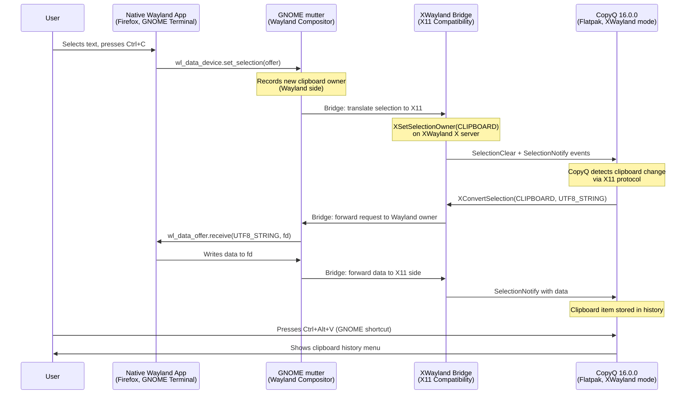
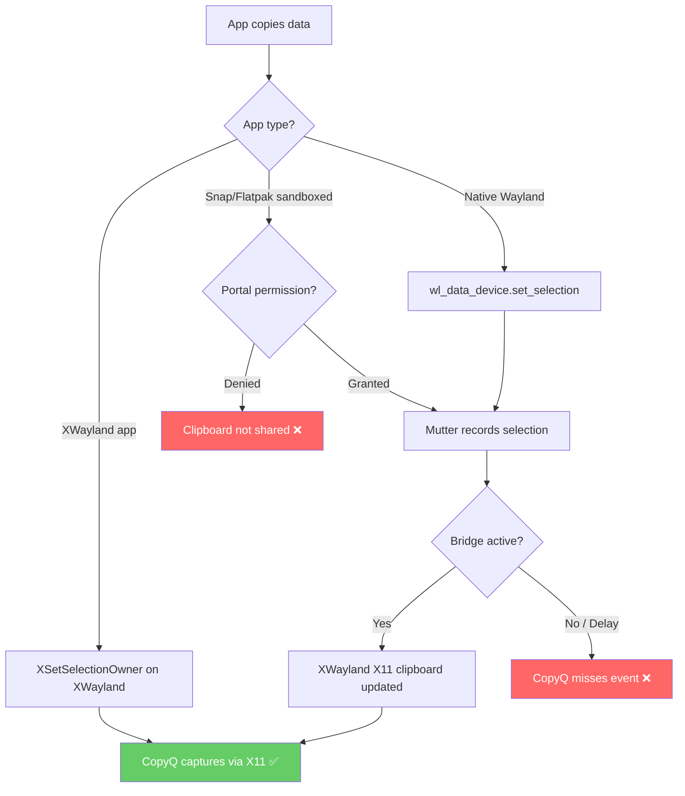
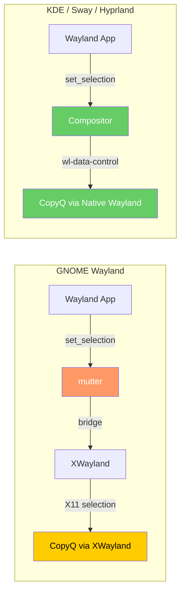

# Wayland Clipboard Architecture: A Deep Technical Dive

> Why clipboard managers are broken on GNOME Wayland, how the XWayland bridge works,
> and what this means for Ubuntu 26.04 LTS.

---

## Table of Contents

1. [X11 Clipboard Model](#1-x11-clipboard-model)
2. [Wayland Clipboard Model](#2-wayland-clipboard-model)
3. [Why GNOME Mutter Does NOT Implement wl-data-control](#3-why-gnome-mutter-does-not-implement-wl-data-control)
4. [XWayland Bridge Architecture](#4-xwayland-bridge-architecture)
5. [Clipboard Flow Diagram](#5-clipboard-flow-diagram)
6. [Compositor Comparison Matrix](#6-compositor-comparison-matrix)
7. [Why This Matters for Ubuntu 26.04 LTS](#7-why-this-matters-for-ubuntu-2604-lts)
8. [Future Outlook](#8-future-outlook)
9. [References](#9-references)

---

## 1. X11 Clipboard Model

### Selection-Based Architecture

The X11 clipboard system, introduced in 1984 with the X Window System, is built on a **selection-based model**. Unlike a centralized clipboard daemon, X11 treats the clipboard as a distributed property of the X server itself. There is no single "clipboard owner" — instead, the X server mediates ownership through an **ownership model**.

### CLIPBOARD vs PRIMARY vs SECONDARY

X11 defines three separate selection atoms:

| Selection | Trigger | Typical Use | Persistent? |
|---|---|---|---|
| **PRIMARY** | Mouse highlight (no click) | Quick paste with middle-click | Lost when selection changes |
| **CLIPBOARD** | Explicit Ctrl+C / Edit > Copy | Traditional clipboard operations | Persists until overwritten |
| **SECONDARY** | Rarely used | Application-specific (e.g., Excel fill) | Varies by app |

### How X11 Clipboard Transfer Works

```
1. App A copies text -> calls XSetSelectionOwner(CLIPBOARD, my_window)
2. X server records: "my_window owns CLIPBOARD"
3. App B pastes -> calls XConvertSelection(CLIPBOARD, "UTF8_STRING")
4. X server sends SelectionRequest event to App A's window
5. App A responds with SelectionNotify + actual data via XChangeProperty
6. App B reads the property from the X server -> paste complete
```

**Key point:** The data is transferred **on-demand** (lazy conversion). The clipboard owner doesn't push data — the paste requester pulls it. This is why clipboard data is lost when the owning app exits.

### Any Application Can Monitor

This is the critical difference from Wayland. On X11:

- **Any** client can call `XSetSelectionOwner()` to observe or intercept clipboard changes
- **Any** client can call `XConvertSelection()` to read clipboard contents
- There is **no permission model** — no compositor gatekeeping, no focus requirement
- A clipboard manager registers itself as an intermediary and simply never surrenders ownership

This design made clipboard managers trivially easy to implement (CopyQ, GPaste, Parcellite, etc.) but also enabled:

- Keyloggers reading clipboard content silently
- Spyware capturing passwords copied from password managers
- Any background process monitoring all copy/paste activity

---

## 2. Wayland Clipboard Model

### Compositor-Gated Access

Wayland was designed from the ground up with a fundamentally different security model. The Wayland protocol specification places the **compositor** as the sole authority over all input, output, and inter-client communication:

- **Clients never talk directly to each other** — all communication goes through the compositor
- **Clients never see each other's windows or surfaces** — no window IDs, no cross-app queries
- **Input events are only sent to the focused surface** — no global input grab
- **Clipboard content is only accessible by the focused client and the compositor**

### Per-Surface Clipboard Ownership

In Wayland, clipboard ownership is tied to the **seat** and the **surface** that last offered data:

```
1. App A (focused) copies -> sends wl_data_device.set_selection(offer, serial)
2. Compositor records: "App A's seat owns the selection"
3. App B (now focused) pastes -> sends wl_data_device.receive(mime_type, fd)
4. Compositor forwards the receive request to App A
5. App A writes the data to the provided file descriptor
6. App B reads from the fd -> paste complete
```

**Critical difference from X11:** Only the **focused** surface can request clipboard content. A background clipboard manager has no protocol-level mechanism to receive clipboard change notifications or request clipboard content.

### Privacy-by-Design

The Wayland clipboard model implements several privacy protections:

1. **No passive monitoring**: An unfocused app cannot listen for clipboard changes
2. **No silent reading**: An app must explicitly request data and the compositor can audit/log this
3. **Per-session isolation**: Each Wayland session has its own clipboard — no cross-session leakage
4. **Data offer model**: The compositor acts as a proxy, forwarding MIME type offers without exposing the data itself until a receive request

### The wl-data-control Protocol

The `wl-data-control` protocol (unstable, `zwp_data_control_manager_v1`) was proposed to allow clipboard managers to function on Wayland. It provides:

- `zwp_data_control_device_v1.data_device` — access to the selection without focus
- `zwp_data_control_device_v1.selection` — notification of selection changes

This protocol is what KDE's KWin, wlroots-based compositors (Sway, Hyprland), and others implement. **GNOME's mutter deliberately does not.**

---

## 3. Why GNOME Mutter Does NOT Implement wl-data-control

### The Privacy Decision

GNOME's design philosophy prioritizes user privacy and security. The `wl-data-control` protocol, while useful for clipboard managers, creates a mechanism that can be exploited:

> Any application with access to the `wl-data-control` protocol can silently monitor all clipboard activity, defeating the privacy protections that Wayland was designed to provide.

### Primary Source: GitHub Issue hluk/CopyQ#2811

This is documented extensively in the CopyQ issue tracker:

- **Issue**: [hluk/CopyQ#2811 — Clipboard doesn't work on Wayland (GNOME)](https://github.com/hluk/CopyQ/issues/2811)
- The CopyQ maintainer (hluk) and GNOME developers have discussed this at length
- GNOME's position: implementing `wl-data-control` would be a privacy regression
- CopyQ's position: without `wl-data-control`, clipboard managers are fundamentally broken on GNOME

### GNOME's Stated Position

From the GNOME/mutter side, the arguments against `wl-data-control` include:

1. **It undermines Wayland's security model** — the protocol essentially re-creates the X11 "any app can read clipboard" problem
2. **No granular permissions** — `wl-data-control` is all-or-nothing; there's no way to grant clipboard read access to only "trusted" managers
3. **Alternative approaches exist** — GNOME Shell extensions, D-Bus APIs, and the XWayland bridge are "sufficient" workarounds
4. **The XDG Desktop Portal** provides a more controlled mechanism via the `Clipboard` portal, though it requires user confirmation dialogs

### Why This Matters

This is not a bug — it is a **deliberate architectural decision**. It means:

- No amount of CopyQ configuration will make native Wayland clipboard monitoring work on GNOME
- The only workaround on GNOME is to use the XWayland bridge (which may not capture all events)
- Users who need native clipboard management on Wayland must use KDE, Sway, Hyprland, or other compositors that implement `wl-data-control`

---

## 4. XWayland Bridge Architecture

### What Is XWayland?

XWayland is a compatibility layer built into most Wayland compositors (including GNOME's mutter) that runs an X11 server alongside the Wayland compositor. It allows X11 applications to run unmodified on Wayland by:

1. Translating X11 protocol requests into Wayland protocol requests
2. Providing an X11 display (`:0` or similar) that X11 apps connect to
3. Bridging input events, clipboard data, and window management

### How Mutter Bridges Clipboard Content

The clipboard bridge is the key mechanism that makes CopyQ work on GNOME Wayland:

```
┌─────────────────────────────────────────────────────────────┐
│                    GNOME mutter compositor                   │
│                                                             │
│  ┌──────────────────────┐    ┌──────────────────────────┐  │
│  │  Wayland Clipboard   │    │   XWayland X11 Server   │  │
│  │     State Machine    │◄──►│   Clipboard Bridge       │  │
│  │                      │    │                          │  │
│  │  - wl_data_source    │    │  - CLIPBOARD selection  │  │
│  │  - wl_data_offer     │    │  - PRIMARY selection    │  │
│  │  - seat tracking     │    │  - SelectionNotify      │  │
│  └──────────────────────┘    └──────────────────────────┘  │
│           ▲                              ▲                  │
│           │                              │                  │
│    Wayland apps                   X11 / XWayland apps       │
└─────────────────────────────────────────────────────────────┘
```

### Bridge Behavior Details

When a **native Wayland app** copies data:

1. The app calls `wl_data_device.set_selection()` on the Wayland protocol
2. Mutter's Wayland clipboard state machine records the new selection
3. Mutter's XWayland bridge detects the selection change
4. The bridge creates a corresponding X11 selection owner in the XWayland server
5. X11 apps (including CopyQ running in XWayland) see the new CLIPBOARD selection

When an **XWayland app** copies data:

1. The app calls `XSetSelectionOwner(CLIPBOARD)` on the XWayland X server
2. The XWayland bridge detects the ownership change
3. The bridge creates a `wl_data_source` and calls `wl_data_device.set_selection()` on the Wayland side
4. Native Wayland apps can then paste the data

### Known Limitations

The bridge is **not bi-directionally perfect**:

- **CLIPBOARD selection**: Generally well-bridged in both directions
- **PRIMARY selection**: May not be bridged consistently (middle-click behavior varies)
- **MIME type translation**: Complex MIME types (e.g., `image/png` with multiple representations) may lose fidelity
- **Large data**: The bridge uses temporary files internally; very large clipboard content may fail or timeout
- **Timing**: There can be a brief window where a clipboard change is visible on one side but not yet bridged to the other
- **Security**: GNOME has discussed adding confirmation dialogs for XWayland clipboard access, which would break CopyQ

---

## 5. Clipboard Flow Diagram

### Native Wayland App → CopyQ via XWayland Bridge



### Why Some Events Are Missed



---

## 6. Compositor Comparison Matrix

### wl-data-control Support

| Compositor | Based On | wl-data-control v1 | Clipboard Manager Support | Notes |
|---|---|---|---|---|
| **GNOME (mutter)** | Clutter/Mutter | **No** ❌ | XWayland bridge only | Privacy-by-design decision |
| **KDE Plasma (kwin)** | Qt/KWayland | **Yes** ✅ | Full native support | Implemented since KDE 5.20+ |
| **Sway** | wlroots | **Yes** ✅ | Full native support | Works with wl-clipboard, Clipman |
| **Hyprland** | Custom (wlroots-like) | **Yes** ✅ | Full native support | Works with wl-clipboard |
| **wlroots (generic)** | — | **Yes** ✅ | Full native support | Available to all wlroots compositors |
| **COSMIC (System76)** | Smithay | **Planned** | TBA | Under active development |
| **Miri** | Mir | **Partial** | Limited | Uses different API surface |

### GNOME vs KDE vs Sway vs Hyprland — Detailed Comparison

| Feature | GNOME (mutter) | KDE Plasma (kwin) | Sway | Hyprland |
|---|---|---|---|---|
| **Wayland support** | Production (default) | Production (default) | Production (default) | Production (default) |
| **XWayland** | Yes, built-in | Yes, built-in | Yes, built-in | Yes, built-in |
| **wl-data-control** | No (by design) | Yes | Yes | Yes |
| **Native clipboard manager** | No | Yes (Klipper built-in) | Yes (wl-clipboard + manager) | Yes (wl-clipboard + manager) |
| **XWayland clipboard bridge** | Yes | Yes | Yes | Yes |
| **CopyQ compatibility** | Partial (XWayland) | Full (native) | Full (native) | Full (native) |
| **Privacy model** | Strict (no passive monitoring) | Moderate (clipboard manager can read) | Moderate | Moderate |
| **Default on Ubuntu** | **Yes (26.04 LTS)** | No | No | No |
| **Custom shortcuts for 3rd-party** | Via GNOME Settings / gsettings | Via KDE System Settings | Via sway config | Via hyprland config |

### Why CopyQ Works Differently on Each



On GNOME, CopyQ must take the indirect path through the XWayland bridge. On KDE, Sway, and Hyprland, CopyQ can use `wl-data-control` directly for native, reliable clipboard monitoring.

---

## 7. Why This Matters for Ubuntu 26.04 LTS

### First Wayland-Only LTS

Ubuntu 26.04 LTS ("Resolute Raccoon") is a **watershed release**:

- **No Xorg session option on the login screen** — Wayland is the only graphical session
- Previous LTS releases (20.04, 22.04, 24.04) all offered Xorg as a fallback
- Users who relied on Xorg for clipboard managers, global hotkeys, or screen recording can no longer switch back

### GNOME 50

Ubuntu 26.04 ships with **GNOME 50**, which continues the mutter policy of not implementing `wl-data-control`. The GNOME Shell team has shown no indication of changing this stance for GNOME 50 or the foreseeable future.

### Impact on Users

| User Scenario | Impact |
|---|---|
| Using CopyQ on Xorg (previous LTS) | Worked perfectly — X11 clipboard model allows monitoring |
| Using CopyQ on Ubuntu 26.04 LTS | Only works via XWayland bridge — some events may be missed |
| Using Klipper (KDE) on Xorg | Worked perfectly |
| Using Klipper on KDE Wayland | Still works perfectly (KDE implements wl-data-control) |
| Using xdotool on Ubuntu 26.04 LTS | Does not work at all — X11 input injection blocked on Wayland |

### No Going Back

Unlike previous LTS releases where users could select "Ubuntu on Xorg" from the login screen:

- Ubuntu 26.04 **removes the Xorg session entirely**
- The Xorg packages (`xserver-xorg`, `xserver-xorg-core`) may still be installable but are not configured or supported
- Even if you install Xorg packages manually, GNOME 50's session configuration does not include an Xorg variant

This means the XWayland bridge workaround described in this repo is not just a convenience — it's the **only viable approach** for running CopyQ on Ubuntu 26.04 LTS.

### Enterprise Impact

For organizations deploying Ubuntu 26.04 LTS at scale:

- **Clipboard managers are a common productivity tool** — many enterprise users depend on multi-item clipboard history
- **The XWayland bridge approach is a workaround, not a fix** — it may have edge cases that don't appear in testing
- **GNOME's stance may change in future releases**, but there's no timeline or commitment
- **The Flatpak approach** (CopyQ 16.0.0 from Flathub) provides the most portable and maintainable solution

---

## 8. Future Outlook

### wl-data-control v2

The Wayland community has discussed a v2 of the data control protocol with improvements:

- **Permission model**: Granular per-app clipboard access control (not just all-or-nothing)
- **Auditing**: Clipboard access logging and notification to the user
- **Scope limitation**: Read-only monitoring vs. write access as separate permissions

However, this is still in the **discussion/proposal phase** and has not been formally standardized. Even if adopted, GNOME would need to choose to implement it.

### GNOME Discussion Threads

Key discussion threads to follow:

- **GNOME mutter merge requests**: [GitLab GNOME/mutter](https://gitlab.gnome.org/GNOME/mutter) — search for "data-control" or "clipboard"
- **CopyQ issue tracker**: [hluk/CopyQ#2811](https://github.com/hluk/CopyQ/issues/2811) — ongoing tracking of Wayland support
- **GNOME design discussions**: [GNOME Discourse](https://discourse.gnome.org/) — search for "clipboard manager wayland"
- **Ubuntu Discourse**: [Ubuntu 26.04 Roadmap](https://discourse.ubuntu.com/t/ubuntu-26-04-lts-the-roadmap/72740)
- **Wayland protocols repo**: [wayland-protocols](https://gitlab.freedesktop.org/wayland/wayland-protocols) — protocol standardization

### Potential Future Scenarios

| Scenario | Likelihood | Impact on CopyQ |
|---|---|---|
| GNOME implements wl-data-control v2 with permissions | Low (near-term), Medium (long-term) | Native Wayland clipboard monitoring would work |
| XDG Desktop Portal Clipboard gains wide adoption | Medium | CopyQ could use the portal API (with user confirmation) |
| GNOME adds XWayland clipboard access restrictions | Medium | Current workaround may break, requiring new approach |
| Ubuntu adds a custom GNOME patch for clipboard | Very Low | Would be an Ubuntu-specific divergence from upstream GNOME |
| CopyQ implements a GNOME Shell extension for clipboard | Medium | Could bypass the protocol limitation entirely |

### The XDG Desktop Portal Approach

An alternative to `wl-data-control` is the **XDG Desktop Portal Clipboard portal**, which provides:

- User-confirmed clipboard access (a dialog appears asking for permission)
- Controlled by the compositor's portal implementation
- Already available on GNOME via `xdg-desktop-portal-gnome`

The downside: every clipboard access would require a user confirmation, which is impractical for a clipboard manager that needs to capture every copy event silently.

---

## 9. References

### Primary Sources

- [hluk/CopyQ#2811 — Clipboard doesn't work on Wayland (GNOME)](https://github.com/hluk/CopyQ/issues/2811)
- [Wayland Protocol Specification](https://wayland.freedesktop.org/)
- [wl-data-control protocol (unstable)](https://gitlab.freedesktop.org/wayland/wayland-protocols/-/blob/main/unstable/data-control/data-control-unstable-v1.xml)
- [GNOME mutter source](https://gitlab.gnome.org/GNOME/mutter)

### Ubuntu-Specific

- [Ubuntu 26.04 Release Notes](https://documentation.ubuntu.com/release-notes/26.04/)
- [Ubuntu 26.04 Roadmap](https://discourse.ubuntu.com/t/ubuntu-26-04-lts-the-roadmap/72740)
- [CopyQ PPA (v13.0.0)](https://launchpad.net/~hluk/+archive/ubuntu/copyq)
- [CopyQ Flathub (v16.0.0)](https://flathub.org/en/apps/com.github.hluk.copyq)

### Community Discussions

- [GNOME Discourse — Clipboard on Wayland](https://discourse.gnome.org/)
- [Reddit r/gnome — Wayland clipboard](https://www.reddit.com/r/gnome/)
- [Arch Wiki — Wayland](https://wiki.archlinux.org/title/Wayland)

---

*Last updated: 2025 · Applies to Ubuntu 26.04 LTS, GNOME 50, CopyQ 16.0.0 (Flatpak)*
